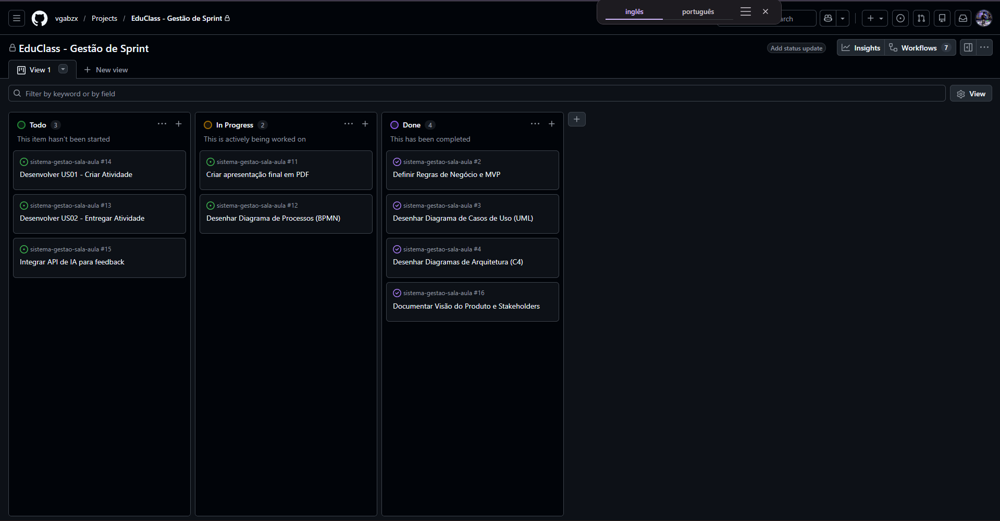

# Diário de Sprint

Este documento registra a organização da nossa equipe (consultoria), a divisão de tarefas ao longo das Sprints e as lições aprendidas durante a concepção e modelagem do Sistema de Gestão de Sala de Aula Online (EduClass).

## 1. Organização e Divisão de Tarefas
A equipe utilizou o **GitHub Projects (Kanban)** para gerenciar o fluxo de trabalho. As responsabilidades foram divididas de forma a garantir que todos os membros participassem ativamente e deixassem o seu registro (commits) no repositório.

* **Gabriel Ferrazza:** Configuração inicial do repositório, gestão do Kanban, estruturação do README e elaboração da Visão do Produto e Stakeholders.
* **Gabriel Mathias:** Levantamento de Regras de Negócio, definição de User Stories e auxílio na modelagem do MVP.
* **Leonardo Bernardi:** Definição da Arquitetura de Software (decisões arquiteturais) e desenvolvimento dos diagramas C4.
* **Thiago Rodrigues:** Modelagem de processos (BPMN) e criação do diagrama de Casos de Uso (UML).

*(Nota: Todos os membros revisaram os documentos uns dos outros para garantir a coerência entre os artefatos.)*

## 2. Principais Decisões Tomadas
* **Estilo arquitetural:** Após avaliar arquitetura em camadas pura e microsserviços, optamos por uma **Arquitetura Híbrida** (núcleo monólito modular em camadas + serviços assíncronos via publish-subscribe), por equilibrar simplicidade de manutenção com escalabilidade das tarefas assíncronas.
* **Autenticação:** Decidimos delegar a autenticação a um Provedor de Identidade externo (OAuth 2.0 / OIDC, com SSO), validando tokens JWT no API Gateway, para habilitar login único e reforçar a segurança exigida pela RN01.
* **Atores e responsabilidades:** Alinhamos os papéis entre todos os artefatos — o Professor é responsável por criar turmas e gerar o código de convite, enquanto o Administrador cuida do cadastro de usuários, permissões e configuração institucional.

## 3. Dificuldades Encontradas e Soluções Adotadas

* **Dificuldade 1:** Definir o estilo arquitetural sem cair em complexidade desnecessária nem em um monólito engessado.
  * **Solução:** Adotamos a arquitetura híbrida, mantendo o domínio central coeso em um monólito modular e isolando apenas as operações assíncronas (notificações e relatórios) em serviços separados, comunicados por eventos.

* **Dificuldade 2:** Integração das Regras de Negócio na Arquitetura.
  * **Solução:** Debatemos em equipe como a regra de "bloquear a exclusão de atividades com submissões" (RN06) impactaria a base de dados e documentamos a necessidade de restrições de chave estrangeira na decisão de usar um banco relacional (PostgreSQL).

* **Dificuldade 3:** Conciliar o escopo do MVP com a arquitetura-alvo dos diagramas.
  * **Solução:** Tratamos os diagramas C4 como a arquitetura-alvo e o MVP como um recorte de escopo sobre a mesma base, deixando claro quais funcionalidades entram na primeira entrega (incluindo notificações essenciais, presentes no BPMN) e quais ficam para versões futuras.

* **Dificuldade 4:** Organização dos diagramas no GitHub sem perder qualidade.
  * **Solução:** Optamos por desenhar os diagramas em ferramentas externas (como Draw.io/Lucidchart), exportar as imagens em alta resolução (PNG) e documentá-las nas respectivas pastas (`uml/`, `bpmn/`, `c4/`).

## 4. Gestão Ágil (Kanban)
Abaixo está o registro do nosso quadro Kanban utilizado para gerenciar as tarefas da equipe durante a Sprint:

