# Diagrama de Casos de Uso (UML)

Este diagrama representa as interações principais entre os atores do sistema (Estudante, Professor, Coordenador e Administrador) e as funcionalidades que cada um pode executar.

**Destaque:** A funcionalidade inovadora "Feedback IA" está representada e integrada no fluxo do professor e estudante.

